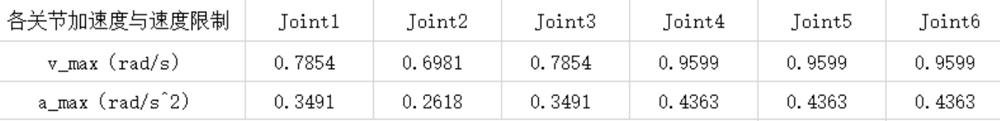

# 实验1-5仿真报告

Michael Gao

代码见`code/probot_gazebo/src`，代码注释完整

仿真结果见`/vedio`

节点运行方式见`ReadMe.pdf`


## 实验一 机械臂正逆运动学

### 一、实验目的

1、巩固正逆运动学基础概念。
2、了解正逆运动学在机械臂控制中的实际用途。


### 二、实验内容及计算原理

1、机械臂模型DH 参数的计算。
2、机械臂正运动学的计算。
3、机械臂逆运动学的计算。

#### (1) 建立机械臂坐标系


##### DH参数表

（单位：mm）

| 关节i | **$\alpha_{i-1} $** | **$a_{i-1} $** | **$d_i $**  | **$\theta_i $** |
| :---: | :-----------------: | :------------: | :---------: | :-------------: |
|   1   |          0          |       0        |  D1（284）  |       Θ1        |
|   2   |         90°         |       0        |      0      |       Θ2        |
|   3   |          0          |   A3（225）    |      0      |       Θ3        |
|   4   |         90°         |       0        | D4（228.9） |       Θ4        |
|   5   |        -90°         |       0        |      0      |       Θ5        |
|   6   |         90°         |       0        |      0      |       Θ6        |
|   7   |          0          |       0        |  D7（55）   |        0        |
|   8   |        -90°         |       0        |      0      |        0        |

关节1-6为实际机械臂关节，对应实际的机械臂旋转；

关节7为最末端机械臂的长度平移；关节8为适应gazebo中末端坐标系的角度旋转；

<u>根据机械臂的实际关节零点位置需要对关节2加偏置</u>：$\pi/2$, 对关节5加偏置：$-\pi/2$.


#### (2)建立机械臂正运动学方程

根据连杆连体坐标系的变换矩阵：
$$
_{i}^{i-1}T=\left[\begin{array}{cccc}{\cos \theta_{i}} & {-\sin \theta_{i}} & {0} & {a_{i-1}} \\ {\sin \theta_{i} \cos \alpha_{i-1}} & {\cos \theta_{i} \cos \alpha_{i-1}} & {-\sin \alpha_{i-1}} & {-\sin \alpha_{i-1} d_{i}} \\ {\sin \theta_{i} \sin \alpha_{i-1}} & {\cos \theta_{i} \sin \alpha_{i-1}} & {\cos \alpha_{i-1}} & {\cos \alpha_{i-1} d_{i}} \\ {0} & {0} & {0} & {1}\end{array}\right]
$$
将六个连杆坐标变换阵相乘：
$$
_{8}^{0}T=\prod_{i=1}^{8} {}_{i}^{i-1}T
$$

$$
_{8}^{0} T=\left[\begin{array}{cccc}{r_{11}} & {r_{12}} & {r_{13}} & {p_{x}} \\ {r_{21}} & {r_{22}} & {r_{23}} & {p_{y}} \\ {r_{31}} & {r_{32}} & {r_{33}} & {p_{z}} \\ {0} & {0} & {0} & {1}\end{array}\right]
$$

得到$^{0}_{8}T$齐次变换矩阵后，该矩阵$[p_x,p_y,p_z]$部分即为末端位置。


##### 固定角表示

现已经得到$^{0}_{8}T$齐次变换矩阵，可由其中的旋转矩阵部分解得$X-Y-Z$固定角，进而表示姿态。

旋转矩阵与固定角间有如下关系：
$$
R_{X Y Z}(\gamma, \beta, \alpha)=\left[\begin{array}{ccc}{\cos \alpha} & {-\sin \alpha} & {0} \\ {\sin \alpha} & {\cos \alpha} & {0} \\ {0} & {0} & {1}\end{array}\right]\left[\begin{array}{ccc}{\cos \beta} & {0} & {\sin \beta} \\ {0} & {1} & {0} \\ {-\sin \beta} & {0} & {\cos \beta}\end{array}\right]\left[\begin{array}{ccc}{1} & {0} & {0} \\ {0} & {\cos \gamma} & {-\sin \gamma} \\ {0} & {\sin \gamma} & {\cos \gamma}\end{array}\right]
$$
任意一个正交旋转矩阵都能反解出$\alpha/\beta/\gamma$：
$$
\left[\begin{array}{ccc}{r_{11}} & {r_{12}} & {r_{13}} \\ {r_{21}} & {r_{22}} & {r_{23}} \\ {r_{31}} & {r_{32}} & {r_{33}}\end{array}\right]=R_{Z ^{\prime} Y ^{\prime}X^{\prime}}(\alpha, \beta, \gamma)
$$

$$
\begin{array}{l}{\beta=\operatorname{Atan} 2\left(-r_{31}, \sqrt{r_{11}^{2}+r_{21}^{2}}\right)} \\ {\alpha=\operatorname{Atan} 2\left(r_{21} / \cos \beta, r_{11} / \cos \beta\right)} \\ {\gamma=\operatorname{Atan} 2\left(r_{32} / \cos \beta, r_{33} / \cos \beta\right)}\end{array}
$$


综上所述，在0坐标系下用$[p_x,p_y,p_z]$和固定角$X-Y-Z$表示机械臂末端位姿，则从关节变量到机械臂末端的**<u>运动学方程</u>**为：

$$
p_x=\frac{1}{5}s_1-\frac{s_5(s_1s_4-c_1c_2c_4)}{10}-\frac{c_1c_5s_2}{10}-L_3c_1s_2
$$

$$
p_y=\frac{s_5(c_1s_4+c_2c_4s_1)}{10}-\frac{c_1}{5}-\frac{c_5s_1s_2}{10}-L_3s_1s_2
$$

$$
p_z=L_3c_2+\frac{c_2c_5}{10}+\frac{c_4s_2s_5}{10}
$$

$$
\begin{array}{l}{\beta=\operatorname{Atan} 2\left(-r_{31}, \sqrt{r_{11}^{2}+r_{21}^{2}}\right)} \\ {\alpha=\operatorname{Atan} 2\left(r_{21} / \cos \beta, r_{11} / \cos \beta\right)} \\ {\gamma=\operatorname{Atan} 2\left(r_{32} / \cos \beta, r_{33} / \cos \beta\right)}\end{array}
$$

其中，$r_{ij}$见第二部分推导.


#### (3)求出机械臂的逆运动学解

现已知基坐标系下的机械臂末端位姿$[p_x,p_y,p_z,roll,pitch,yaw]$，可以由公式计算齐次变换矩阵$^0_8T$：
$$
R^0_8=\left[\begin{array}{ccc}
C \alpha C \beta & C \alpha S \beta S \gamma-S \alpha C \gamma & C \alpha S \beta C \gamma+S \alpha S \gamma \\
S \alpha C \beta & S \alpha S \beta S \gamma+C \alpha C \gamma & S \alpha S \beta C \gamma-C \alpha S \gamma \\
-S \beta & C \beta S \gamma & C \beta C \gamma
\end{array}\right]
$$

$$
P_8^0=[p_x,p_y,p_z]
$$

$$
_{8}^{0} T=\left[\begin{array}{cccc}
R_8^0 & P_8^0\\
0&{1}
\end{array}\right]
$$
现需要解算各关节变量：

尝试使用PIREPER法进行逆运动学求解

由于PIREPER法要求机械臂的最后3个轴相交，故先将坐标系6的齐次变换矩阵算出：
$$
^0_6T = ^0_8T ({}^7_8T^{-1})( {}^6_7T^{-1})
$$

以下将$^0_6T$作为已知量，$[x,y,z]^T$为$^0_6T$中的位置矢量


##### 前3关节角

满足如下关系：

$$
\left[\begin{array}{l}{x} \\ {y} \\ {z} \\ {1}\end{array}\right]=\left[\begin{array}{c}{^{0} P_{4 O R G}} \\ {1}\end{array}\right]=_{1}^{0} T_{2}^{1} T_{3}^{2} T\left[\begin{array}{c}{^{3} P_{4OR G}} \\ {1}\end{array}\right]
$$
逐层计算：

---

$$
\left[\begin{array}{c}
^{2} P_{4 O R G} \\
1
\end{array}\right]=_{3}^{2} T\left[\begin{array}{c}
^{3} P_{4 O R G} \\
1
\end{array}\right]
=
\left[\begin{array}{c}
f_1 \\f_2\\f_3\\
1
\end{array}\right]
$$

其中，
$$
\left\{\begin{array}{l}
f_{1}=d_{4} S_{3}+a_{2} \\
f_{2}=-d_{4} C_{3} \\
f_{3}=0
\end{array}\right.
$$

---

$$
\left[\begin{array}{c}
^{1} P_{4 O R G} \\
1
\end{array}\right]=_{2}^{1} T\left[\begin{array}{c}
^{2} P_{4 O R G} \\
1
\end{array}\right]
=
\left[\begin{array}{c}
g_1 \\g_2\\g_3\\
1
\end{array}\right]
$$

其中，
$$
\left\{\begin{array}{l}
g_{1}=C_{2}\left(d_{4} S_{3}+a_{2}\right)+d_{4} S_{2} C_{3} \\
g_{2}=0 \\
g_{3}=S_{2}\left(d_{4} S_{3}+a_{3}\right)-d_{4} C_{2} C_{3}
\end{array}\right.
$$

---

$$
\left[\begin{array}{l}
x \\
y \\
z \\
1
\end{array}\right]=\left[\begin{array}{c}
^{0} P_{4O R G} \\
1
\end{array}\right]=_{1}^{0} T\left[\begin{array}{c}
^{1} P_{40 R G} \\
1
\end{array}\right]
=
\left[\begin{array}{c}
C_1g_1-S_1g_2 \\S_1g_1+C_1g_2\\g_3\\
1
\end{array}\right] \tag{1}
$$

由上式可得：
$$
r=x^2+y^2+z^2=d_4^2+a_2^2+2d_4a_2S_3 \tag{2}\\
$$

$$
z=S_2(d_4S_3+a_2)-d_4C_2C_3 \tag{3}
$$

---

解$\theta_3$:

由（2）：
$$
\theta_3=asin(\frac{r-d_4^2-a_2^2}{2d_4a_2})
$$

---

解$\theta_2$:

由（3），令$u=tan(\theta_2/2)$:
$$
\left(d_{4} C_{3}-z\right)  u^{2}+2\left(d4 S_{3}+a_{2}\right)  u-\left(d_{4} C_{3}+z\right)=0
$$

$$
\theta_2=2atan(u)
$$

---

解$\theta_1$:

由（1）可得：
$$
\left[\begin{array}{l}
x \\
y
\end{array}\right]=\left[\begin{array}{l}
c_{1} g_{1}-s_{1} g_{2} \\
s_{1} g_{1}+c_{1} g_{2}
\end{array}\right]
$$

$$
\theta_1=acos(x/g_1)
$$

$\theta_1$需满足：
$$
y=sin\theta_1g_1
$$

---


##### 后3关节角

进一步通过欧拉角求解最后三个关节角:

首先算出坐标4相对于基坐标的姿态：
$$
\left._{4}^{0} R\right|_{\theta_{4}=0}=\left._{3}^{0} R_{4}^{3} R\right|_{\theta_{4}=0}
$$
则最后三个关节的旋转矩阵为：
$$
\left._{6}^{4} R\right|_{\theta_{4}=0}=\left._{4}^{0} R^{-1}\right|_{\theta_{4}=0}\cdot\left._{6}^{0} R\right.
$$

由旋转矩阵求解$Z-Y-Z$欧拉角公式得：
$$
\begin{array}{l}{\beta=\operatorname{Atan} 2\left(\sqrt{r_{31}^{2}+r_{32}^{2}}, r_{33}\right)} \\ {\alpha=\operatorname{Atan} 2\left(r_{23} / \sin \beta, r_{13} / \sin \beta\right)} \\ {\gamma=\operatorname{Atan} 2\left(r_{32} / \sin \beta,-r_{31} / \sin \beta\right)}\end{array}
$$
最终求解各关节变量.


### 三、实验步骤及结果

#### （1）正运动学验证

给出关节角，计算末端位置：

##### 第一组

关节角：$[0.927, -0.687, -0.396, 0, 1.083, 0.927]$

正运动学计算末端位姿：  $[0.150047, 0.19994,0.200756,1.5708,0,0]$

Gazebo仿真种末端位姿：$[0.150035, 0.199922,0.200783,1.570801,0,0]$


位姿绝对误差：$[0.000012,0.000018,-0.000027,-0.000001,0,0]$

误差极小，几乎可以忽略不计.

<u>运行结果</u>：（注：图中`RobotAngle`关节角是根据前述DH参数增加偏置前的关节角）


##### 第二组

关节角：$[0.322, -0.855, -0.021, 0, 0.877, 0.322]$

正运动学计算末端位姿：  $[0.300121, 0.100124,0.200812,1.571110,-0.000950,0]$

Gazebo仿真种末端位姿：$[0.300094, 0.100114,0.200833,1.571116,-0.000948,0]$


位姿绝对误差：$[0.000027,0.00001,-0.000021,-0.000006,-0.000002,0]$

误差极小，几乎可以忽略不计.

<u>运行结果</u>：（注：图中`RobotAngle`关节角是根据前述DH参数增加偏置前的关节角）


##### 第三组

关节角：$[-0.322, -0.636, -0.011, 0, 0.647, -0.322]$

正运动学计算末端位姿：  $[0.300029, -0.100093,0.272028,1.5708,0,0]$

Gazebo仿真种末端位姿：$[0.299995, -0.100083,0.272040,1.57081,0,0]$


位姿绝对误差：$[0.000034,-0.00001,-0.000022,-0.000001,0,0]$

误差极小，几乎可以忽略不计.

<u>运行结果</u>：（注：图中`RobotAngle`关节角是根据前述DH参数增加偏置前的关节角）


#### （2）逆运动学验证

给出末端位置，计算关节角：

若不考虑关节角转动范围限制，<u>**每个末端位置可解出8个解**</u>，解出所有解后再取符合关节范围的解，publish 验证.


##### 第一组

末端位姿：$[0.2, 0.2, 0.2007,1.57, -1.57, 0]$

逆运动学计算关节角：

在范围内共有4组解：

```
----Check 0----
resRobotAngle: 0.943488, -0.924743, -0.347274, -2.17673, 0.173647, 2.89722

----Check 1----
resRobotAngle: 0.943488, -0.924743, -0.347274, 0.964865, 2.96795, -0.244375

----Check 2----
resRobotAngle: -2.1981, 0.924743, 3.48887, 0.964865, 0.173647, 2.89722

----Check 3----
resRobotAngle: -2.1981, 0.924743, 3.48887, -2.17673, 2.96795, -0.244375
```


Gazebo中末端位姿与预设位姿误差：$[-0.0054,-0.000011,0.00003,0,0,0]$

运行结果：

（4组解的gazebo执行结果见`vedio/逆运动学-第1组-4个解.mp4`）


##### 第二组

末端位姿：$[0.15 ,0.2, 0.2007, 0, 0, 0]$

逆运动学计算关节角：

在范围内共有4组解：

```
----Check 0---- 
resRobotAngle: 1.03907, -1.00894, -0.0831629, -0.585271, -0.408274, 1.31351

----Check 1---- 
resRobotAngle: 1.03907, -1.00894, -0.0831629, 2.55632, 3.54987, -1.82808

----Check 2----
resRobotAngle: -2.10252, 1.00894, 3.22476, 2.55632, -0.408274, 1.31351

----Check 3----
resRobotAngle: -2.10252, 1.00894, 3.22476, -0.585271, 3.54987, -1.82808
```


Gazebo中末端位姿与预设位姿误差：$[-0.000011,-0.000018,0.000026,0.000004,0,0]$

误差极小，几乎可以忽略不计.

运行结果：

（4组解的gazebo执行结果见`vedio/逆运动学-第2组-4个解.mp4`）


##### 第三组

末端位姿：$[0.3 ,0, 0.122, 1.57, 0, 0]$

逆运动学计算关节角：

在范围内共有3组解：

```
----Check 0----
resRobotAngle: 0, -1.11165, -0.0152543, -0, 1.1269, -0

----Check 1----
resRobotAngle: 0, -1.11165, -0.0152543, 3.14159, 2.01469, 3.14159

----Check 2---- 
resRobotAngle: 3.14159, 1.11165, 3.15685, -3.14159, 1.1269, -0

----Check 3---- 
resRobotAngle: 3.14159, 1.11165, 3.15685, 0, 2.01469, 3.14159
```


Gazebo中末端位姿与预设位姿误差：$[-0.000019,0,0.000026,0.000801,0,0]$

误差极小，几乎可以忽略不计.

运行结果：

（4组解的gazebo执行结果见`vedio/逆运动学-第3组-4个解.mp4`）


## 实验三 速度传递实验

### 一、实验目的

1、掌握雅可比矩阵的计算方法
2、掌握通过雅可比矩阵反解关节速度的方法
3、掌握实时刷新机械臂关节速度的方法


### 二、实验内容及计算原理

1、编写计算雅可比矩阵的代码
2、实现机械臂末端运动速度的控制


定义笛卡尔速度矢量：$v_{N}=\left[\begin{array}{l}
v_{N} \\
\omega_{N}
\end{array}\right]$ 和关节角空间矢量 $\dot{\Theta}=\left[\begin{array}{c}
\dot{\theta}_{1} \\
\dot{\theta}_{2} \\
\vdots \\
\dot{\theta}_{N}
\end{array}\right]$

雅可比矩阵形式：
$$
v_{N}=\left[\begin{array}{ccccc}
\hat{Z}_{1} \times\left(P_{N}-P_{1}\right) & \hat{Z}_{2} \times\left(P_{N}-P_{2}\right) & \cdots & \hat{Z}_{N-1} \times\left(P_{N}-P_{N-1}\right) & 0 \\
\hat{Z}_{1} & \hat{Z}_{2} & \cdots & \hat{Z}_{N-1} & \hat{Z}_{N}
\end{array}\right] \dot{\Theta}
$$

其中，$P_i$为齐次变换矩阵最右侧一列前三项$[p_x,p_y,p_z] $，$\hat{Z}_{i} $为旋转矩阵最右侧一列$[r_{13},r_{23},r_{33}]$ :
$$
T_i=\left[\begin{array}{cccc}{r_{11}} & {r_{12}} & {r_{13}} & {p_{x}} \\ {r_{21}} & {r_{22}} & {r_{23}} & {p_{y}} \\ {r_{31}} & {r_{32}} & {r_{33}} & {p_{z}} \\ {0} & {0} & {0} & {1}\end{array}\right]
$$
齐次变换矩阵计算见实验一.


### 三、实验步骤及结果

程序流程图：


初始末端位置：$[0.229,0,0.454]$

期望运动距离：$[0.15,0,-0.15]$

速度曲线：


运行结果：

（gazebo执行结果见`vedio/速度传递.mp4`）


结束时末端位置：$[0.379,0,0.304]$

运动距离：$[0.15,0,-0.15]$

无误差.


## 实验四 轨迹生成实验

### 一、实验目的

1、巩固机械臂轨迹的五次多项式插值方法
2、掌握通过速度控制使机械臂按预期的轨迹去运动到指定位置

### 二、实验内容及计算原理

#### (1) 逆运动学求解

推导计算过程见实验一

#### (2) Mini-jerk 五次多项式最优轨迹生成

轨迹采用5次多项式进行拟合，保证位置、速度、加速度均连续。

该机械臂的6个关节轨迹可以分别进行规划，以下对其中一个关节进行轨迹规划。

已知一个关节需要到达的M个角度，利用多项式拟合会有 (M-1)段轨迹，表示如下：
$$
f(t)=\left\{\begin{array}{ll}
f_{1}(t) \doteq \sum_{i=0}^{N} p_{1, i} t^{i} & T_{0} \leq t \leq T_{1} \\
f_{2}(t) \doteq \sum_{i=0}^{N} p_{2, i} t^{i} & T_{1} \leq t \leq T_{2} \\
\vdots & \vdots \\
f_{M}(t) \doteq \sum_{i=0}^{N} p_{M, i} t^{i} & T_{M-1} \leq t \leq T_{M}
\end{array}\right.
$$
每段轨迹都用多项式表示，该轨迹集合需要满足以下约束条件：

##### a)    期望角度约束

每段轨迹的起点和终点固定为M个角度中的对应值：
$$
\left\{\begin{aligned}
f_{j}^{(k)}\left(T_{j-1}\right) &=x_{0, j}^{(k)} \\
f_{j}^{(k)}\left(T_{j}\right) &=x_{T, j}^{(k)}
\end{aligned}\right.
$$

##### b)    连续性约束

相邻轨迹的速度和加速度连续：
$$
f_{j}^{(k)}\left(T_{j}\right)=f_{j+1}^{(k)}\left(T_{j}\right)
$$
选择代价函数为所有轨迹的jerk值，使其最小。

**代价函数**表示如下：
$$
J(T)=\int_{T_{j-1}}^{T_{j}}\left(f^{3}(t)\right)^{2} d t=\sum_{i \geq 4, l \geq 4} \frac{i(i-1)(i-2) j(l-1)(l-2)}{i+l-5}\left(T_{j}^{i+l-5}-T_{j-1}^{i+l-5}\right) p_{i} p_{l}
$$


将上述等式写为矩阵形式：
$$
\min \left[\begin{array}{c}
\mathbf{p}_{1} \\
\vdots \\
\mathbf{p}_{M}
\end{array}\right]^{T}\left[\begin{array}{ccc}
\mathbf{Q}_{1} & \mathbf{0} & \mathbf{0} \\
\mathbf{0} & \ddots & \mathbf{0} \\
\mathbf{0} & \mathbf{0} & \mathbf{Q}_{M}
\end{array}\right]\left[\begin{array}{c}
\mathbf{p}_{1} \\
\vdots \\
\mathbf{p}_{M}
\end{array}\right]
$$

$$
\text { s.t. } A_{\mathrm{eq}}\left[\begin{array}{c}
\mathbf{p}_{1} \\
\vdots \\
\mathbf{p}_{M}
\end{array}\right]=\mathbf{d}_{e q}
$$

此问题是经典的凸优化问题：QP二次优化问题，可以快速求解.

因此<u>能够自动地选择最优的中间点速度和加速度</u>，进而生成最优轨迹.

机械臂关节的速度和加速度需要满足如下要求：




### 三、实验步骤及结果

#### (1) 逆运动学求解路径点对应关节角

给定路径点如下：

```
第一个点：[0.2289, 0, 0.454, 1.57, 0, 0]（初始门位置）
第二个点：[0.3, 0.25, 0.322, 1.57, -1.57, 0]
第三个点：[0.3, 0.1, 0.172, 1.57, -1.57, 0]
第四个点：[0.3, -0.1, 0.122, 1.57, -1.57, 0]
```

根据实验一求得四个路径点的关节角：

```matlab
p1 = [0 0 0 0 0 0];
p2 = [0.795586 -0.772686  0.205056   1.08734   2.51046 -0.842853];
p3 = [0.387677  -1.07517 -0.199884  0.404374   2.86768 -0.114923];
p4 = [-0.387371   -1.29256 -0.0658126  -0.394643    2.94426  0.0811483];
```

#### (2) 生成最优5次多项式轨迹

根据上述计算原理，生成轨迹，一共4个路径点，共生成3段轨迹，每段轨迹耗时10s走完.

$P-V-A $曲线如下：


根据图像，关节的速度和加速度均满足要求.

#### (3) 速度生成

利用ROS自带的`ros::time`计时器获取当前时刻，代入求解出的轨迹参数即可获得速度.

将速度publish，Gazebo运行结果见`轨迹生成.mp4`.


**终点姿态误差**：$[-0.000004,-0.000008,0.000141,-0.005,0.0001,-0.005]$

最大位姿相对误差 $=0.005/1.57=0.32\%$

由于代码订阅了机械臂末端位姿，故可通过末端位姿判断是否经过中间点：

**第二个路径点**：

```
-------------------t: 10
Link6Pose: 0.300681 0.249464 0.323145
nowRobotAngle:   0.79511 -0.772247  0.205088   1.08685   2.50919 -0.842585

resuial to No.1 : 0.00094727
Get wayPoint No.1   !!!!!!!!!!!!!!!
```

**第三个路径点**：

```
-------------------t: 20.001
Link6Pose: 0.299868 0.100443 0.172244
nowRobotAngle:  0.388355  -1.07509 -0.199812  0.405073   2.86795 -0.115315

resuial to No.2 : 0.000834903
Get wayPoint No.2   !!!!!!!!!!!!!!!
```

其中`resuial`是所有位姿参数误差绝对值之和，可见<u>经过了两个中间点</u>.


## 实验五 定点转动实验

### 一、实验目的

1、掌握定点转动的计算与并实际运用

### 二、实验内容

1、定点转动指机械臂末端坐标始终保持不变，只改变姿态的运动
2、在仿真实验中，使机械臂末端保持初始门位置坐标[0.2289, 0, 0.454]，
在此处定点转动，在真实机器人实验中，可以自选位置.但定点转动的幅度不可
太小，转动角度须不小于40°.
3、自选方法，生成机械臂末端定点转动的轨迹，并在机器人实现。

### 三、实验步骤及结果

利用速度传递实验中的Jacobi矩阵，机械臂末端定点转动即为末端线速度为0，只有绕一个轴的角速度为一定值即可.

此实验中，设定期望的末端速度为：
$$
\left[\begin{array}{c}
0&0&0&-0.2&0&0
\end{array}\right]
$$
则机械臂末端绕x轴匀速转动，第五关节转动角度为360°.


Gazebo仿真结果见：`定点转动.mp4`


根据视频中机械臂运动状态和命令行中监听的机械臂末端位置，可以得到结论：

- 末端的坐标在整个运动过程中几乎没有改变，误差控制在毫米级别
- 定点转动十分连贯
- 定点转动幅度$\gt 180°$


