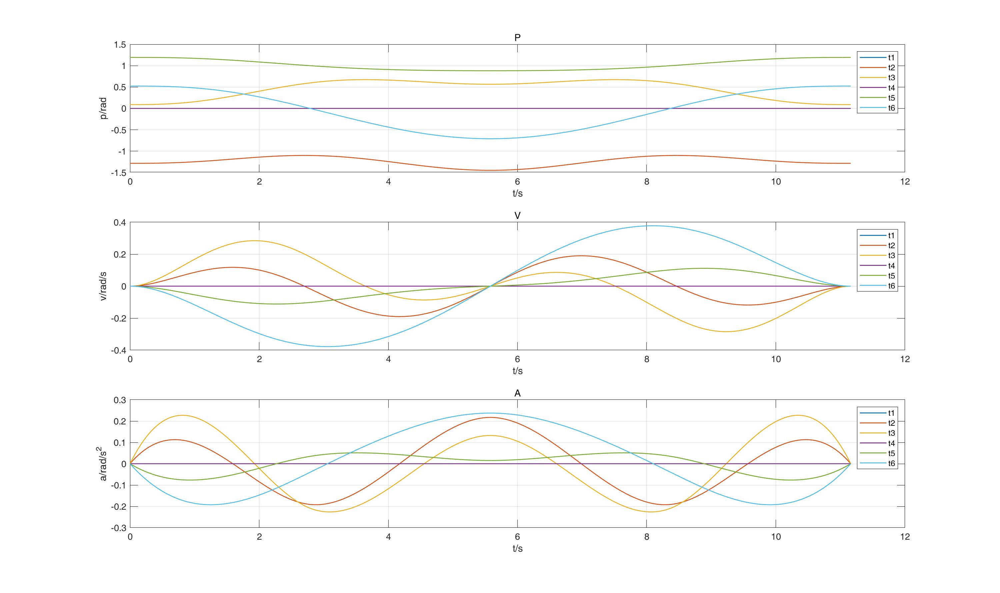

## 考核实验：机械臂避碰敲铃任务

高钰满，3170105242

### 一、实验目的

考察学生对机械臂轨迹生成的编程能力和机械臂使用熟练度

### 二、实验内容

使机械臂能尽可能快地避开障碍物往返运动并敲响铃铛，在规定的时间内，敲响铃铛次数越多的小组，得分越高。

### 三、考核要求

给定起始点A，中间路径点B 和终点C，终点C 处有一铃铛，同时给出中间障碍物的空间位置，请优化设计机械臂的轨迹，使之快速往返敲铃。编程使机械臂完成以下运动：机械臂末端从起始点A 开始运动，经过路径点B，绕开中间障碍物，到达铃铛处敲响铃铛后，再返回起始点，然后再去敲响铃铛，做快速的往复的敲铃运动

### 四、实验计算原理

#### (1) 建立机械臂坐标系


##### DH参数表

（单位：mm）

| 关节i | **$\alpha_{i-1} $** | **$a_{i-1} $** | **$d_i $**  | **$\theta_i $** |
| :---: | :-----------------: | :------------: | :---------: | :-------------: |
|   1   |          0          |       0        |  D1（284）  |       Θ1        |
|   2   |         90°         |       0        |      0      |       Θ2        |
|   3   |          0          |   A3（225）    |      0      |       Θ3        |
|   4   |         90°         |       0        | D4（228.9） |       Θ4        |
|   5   |        -90°         |       0        |      0      |       Θ5        |
|   6   |         90°         |       0        |      0      |       Θ6        |
|   7   |          0          |       0        |  D7（55）   |        0        |
|   8   |        -90°         |       0        |      0      |        0        |

关节1-6为实际机械臂关节，对应实际的机械臂旋转；

关节7为最末端机械臂的长度平移；关节8为适应gazebo中末端坐标系的角度旋转；

<u>根据机械臂的实际关节零点位置需要对关节2加偏置</u>：$\pi/2$, 对关节5加偏置：$-\pi/2$.


#### (2) Mini-jerk 五次多项式最优轨迹生成

轨迹采用5次多项式进行拟合，保证位置、速度、加速度均连续。

该机械臂的6个关节轨迹可以分别进行规划，以下对其中一个关节进行轨迹规划。

已知一个关节需要到达的M个角度，利用多项式拟合会有 (M-1)段轨迹，表示如下：
$$
f(t)=\left\{\begin{array}{ll}
f_{1}(t) \doteq \sum_{i=0}^{N} p_{1, i} t^{i} & T_{0} \leq t \leq T_{1} \\
f_{2}(t) \doteq \sum_{i=0}^{N} p_{2, i} t^{i} & T_{1} \leq t \leq T_{2} \\
\vdots & \vdots \\
f_{M}(t) \doteq \sum_{i=0}^{N} p_{M, i} t^{i} & T_{M-1} \leq t \leq T_{M}
\end{array}\right.
$$
每段轨迹都用多项式表示，该轨迹集合需要满足以下约束条件：

##### a)    期望角度约束

每段轨迹的起点和终点固定为M个角度中的对应值：
$$
\left\{\begin{aligned}
f_{j}^{(k)}\left(T_{j-1}\right) &=x_{0, j}^{(k)} \\
f_{j}^{(k)}\left(T_{j}\right) &=x_{T, j}^{(k)}
\end{aligned}\right.
$$

##### b)    连续性约束

相邻轨迹的速度和加速度连续：
$$
f_{j}^{(k)}\left(T_{j}\right)=f_{j+1}^{(k)}\left(T_{j}\right)
$$
选择代价函数为所有轨迹的jerk值，使其最小。

**代价函数**表示如下：
$$
J(T)=\int_{T_{j-1}}^{T_{j}}\left(f^{3}(t)\right)^{2} d t=\sum_{i \geq 4, l \geq 4} \frac{i(i-1)(i-2) j(l-1)(l-2)}{i+l-5}\left(T_{j}^{i+l-5}-T_{j-1}^{i+l-5}\right) p_{i} p_{l}
$$


将上述等式写为矩阵形式：
$$
\min \left[\begin{array}{c}
\mathbf{p}_{1} \\
\vdots \\
\mathbf{p}_{M}
\end{array}\right]^{T}\left[\begin{array}{ccc}
\mathbf{Q}_{1} & \mathbf{0} & \mathbf{0} \\
\mathbf{0} & \ddots & \mathbf{0} \\
\mathbf{0} & \mathbf{0} & \mathbf{Q}_{M}
\end{array}\right]\left[\begin{array}{c}
\mathbf{p}_{1} \\
\vdots \\
\mathbf{p}_{M}
\end{array}\right]
$$

$$
\text { s.t. } A_{\mathrm{eq}}\left[\begin{array}{c}
\mathbf{p}_{1} \\
\vdots \\
\mathbf{p}_{M}
\end{array}\right]=\mathbf{d}_{e q}
$$

此问题是经典的凸优化问题：QP二次优化问题，可以快速求解.

因此<u>能够自动地选择最优的中间点速度和加速度</u>，进而生成最优轨迹.

机械臂关节的速度和加速度需要满足如下要求：


### 五、实验步骤及结果

**<u>目标为在100s内敲铃9次</u>**

#### (1) 选取路径点

初始位置位姿：$P_1=[0.2289, 0, 0.454, 1.57,0,0]$

蓝球位姿：$P_2=[0.26,0.15,0.08, 1.57,0,0]$

红球位姿：$P_4[0.28,‐0.24,0.08,1.57,0,0]$

为使机械臂不碰撞障碍物，选取障碍物上方中间点：$P_3=[0.4,0,0.26,1.57,0,0]$作为机械臂末端需要经过的中间点.

故第一次的路径点序列为$[P_1,P_2,P_3,P_4,P_3,P_2]$，在起点和终点位置时各关节v,a均为0

第二次路径点序列为$$[P_2,P_3,P_4,P_3,P_2]$$，在起点和终点位置时各关节v,a均为0

之后的路径点序列与第二次相同，故只用规划第一次和第二的路径点序列轨迹即可.


#### (2) 逆运动学求解路径点对应关节角

逆运动学求得四个路径点的关节角：

```matlab
p1 = [0 0 0 0 0 0];
p2 = [0.523278 -1.28342 0.0902228 0 1.19319 0.523278];
p3 = [0 -1.10021 0.597412 0 0.881978 0];
p4 = [-0.708626 -1.44733 0.565348 0 0.881978 -0.708626];
```


#### (3) 生成最优5次多项式轨迹

根据上述计算原理，生成轨迹.

**第一次路径点序列**

路径点序列为：$[P_1,P_2,P_3,P_4,P_3,P_2]$

一共6个路径点，共生成5段轨迹，每段轨迹耗时分别为:$[5,2.79,2.79,2.79,2.79]$

$P-V-A $曲线如下：


根据图像，关节的速度均小于0.4，满足要求.

关节加速度最大的为第二关节，最大加速度为0.255，小于最大限制0.2618，满足要求.


**第二次路径点序列**

路径点序列为：$[P_2,P_3,P_4,P_3,P_2]$

一共5个路径点，共生成4段轨迹，每段轨迹耗时分别为:$[2.79,2.79,2.79,2.79]$

$P-V-A $曲线如下：



根据图像，关节的速度均小于0.4，满足要求.

关节加速度均满足要求.


#### (4) 速度生成

利用ROS自带的`ros::time`计时器获取当前时刻，代入求解出的轨迹参数即可获得速度.

将速度publish，Gazebo运行结果见`轨迹生成.mp4`.


9次敲铃后到达终点姿态误差：$[0.0018,0.00057,0.002,0.0065,-0.0097,-0.0071]$

位置误差在2毫米左右，精度较高.


根据视频中机械臂运动状态和命令行中监听的机械臂末端位置，可以得到结论：

- 每次到达红球和蓝球位置误差均不超过2mm
- 运动连贯无卡顿
- 未接触障碍物


